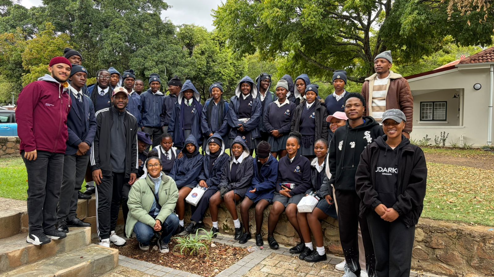
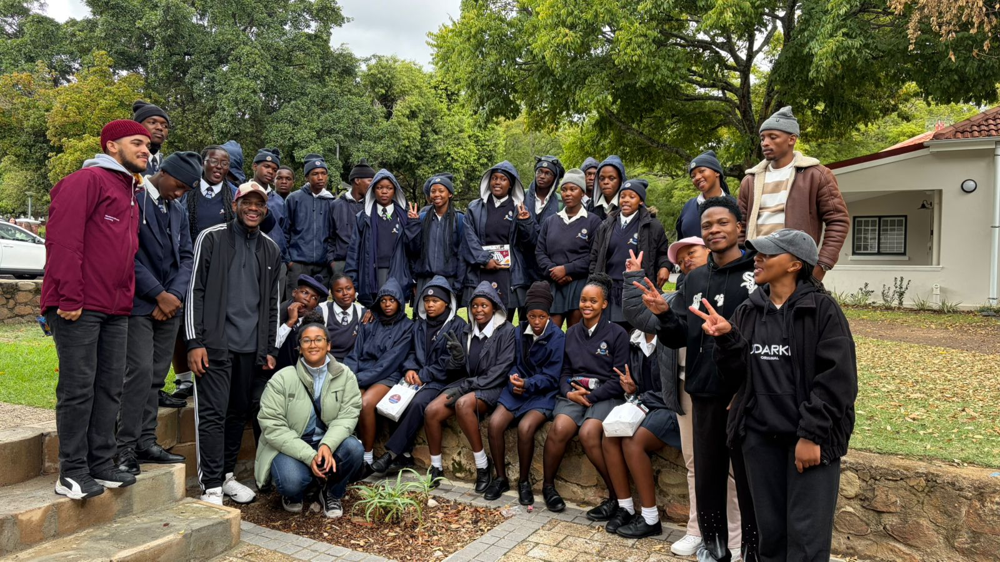
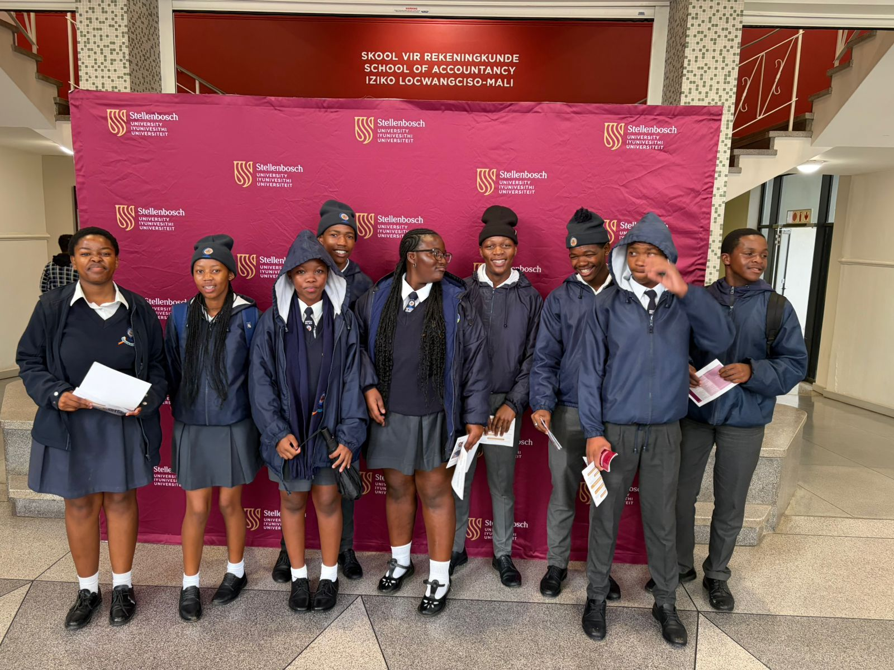
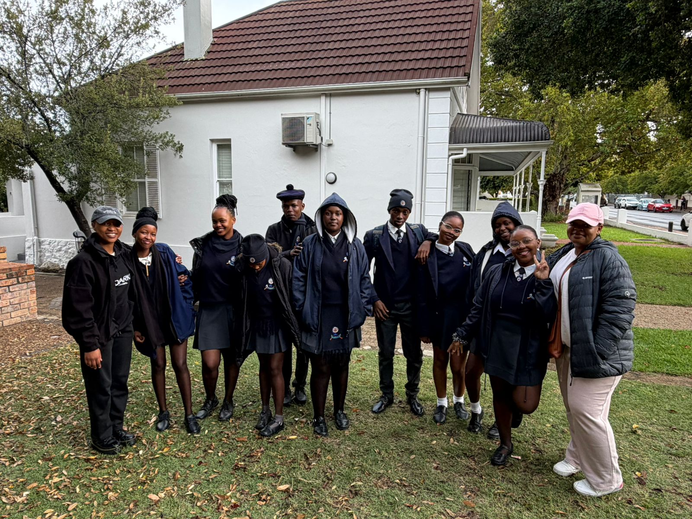
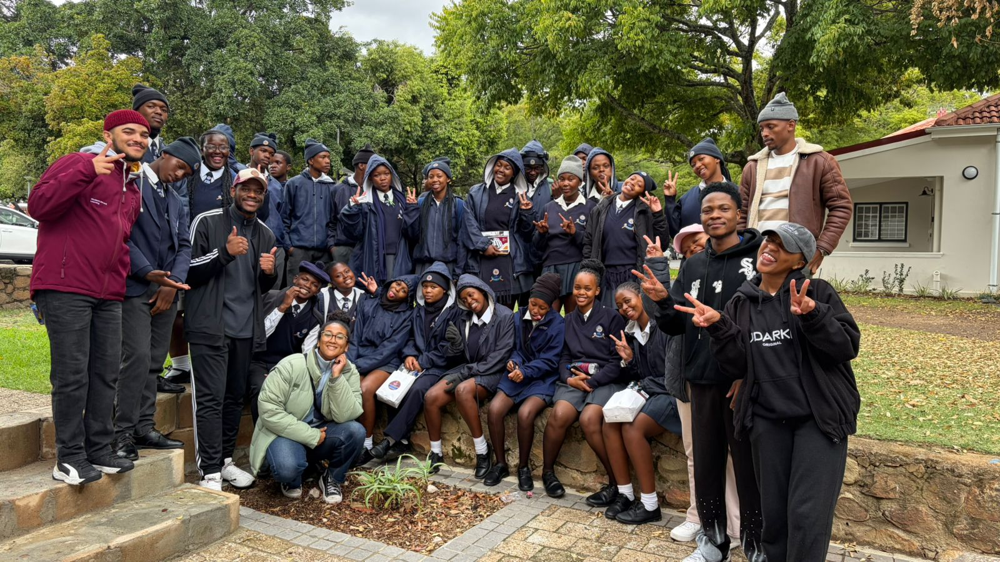
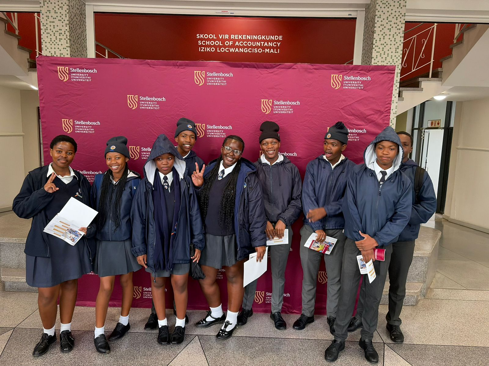

```{=html}
<!-- ══════════════════════════════════════════════════════
     NAVIGATION
══════════════════════════════════════════════════════ -->
<nav class="nav">
  <div class="nav-inner">
    <button class="nav-brand" onclick="goTo('home')">61 Victoria</button>
    <ul class="nav-links">
      <li><button onclick="goTo('home')" id="nav-home">Home</button></li>
      <li><button onclick="goTo('project')" id="nav-project">The Project</button></li>
      <li><button onclick="goTo('dinner')" id="nav-dinner">Dinner Guests</button></li>
      <li><button onclick="goTo('reflections')" id="nav-reflections">Reflections</button></li>
      <li><button onclick="goTo('partners')" id="nav-partners">Partners</button></li>
    </ul>
    <button class="nav-hamburger" onclick="toggleMenu()" aria-label="Open menu">
      <span></span><span></span><span></span>
    </button>
  </div>
  <div class="nav-mobile-menu" id="mobile-menu">
    <button onclick="goTo('home');toggleMenu()">Home</button>
    <button onclick="goTo('project');toggleMenu()">The Project</button>
    <button onclick="goTo('dinner');toggleMenu()">Dinner Guests</button>
    <button onclick="goTo('reflections');toggleMenu()">Housemate Reflections</button>
    <button onclick="goTo('partners');toggleMenu()">Partners</button>
  </div>
</nav>


<!-- ══════════════════════════════════════════════════════
     PAGE: HOME (WELCOME)
══════════════════════════════════════════════════════ -->
<div id="page-home" class="page active">

  <!-- Hero -->
  <div class="home-hero">
    <div class="home-hero-wm" aria-hidden="true">61</div>
    <div class="home-hero-inner">
      <div class="home-eyebrow">
        <svg viewBox="0 0 24 24" width="14" height="14" fill="none" stroke="#fff" stroke-width="2" aria-hidden="true"><path d="M12 2L2 7l10 5 10-5-10-5zM2 17l10 5 10-5M2 12l10 5 10-5"/></svg>
        LLL Senior Living Spaces · 2026
      </div>
      <h1>Welcome to<br><em>61 Victoria</em></h1>
      <p class="home-hero-sub">
        We are a Stellenbosch University house committed to quality education
        and equipping Makupula Secondary School learners with the tools
        to access higher education.
      </p>
      <div class="home-stats">
        <div class="home-stat"><div class="num">SDG&nbsp;4</div><div class="lbl">Our focus</div></div>
        <div class="home-stat"><div class="num">3</div><div class="lbl">Concepts</div></div>
        <div class="home-stat"><div class="num">2+</div><div class="lbl">Years running</div></div>
      </div>
    </div>
  </div>

  <!-- Ribbon -->
  <div class="home-ribbon">
    <div class="home-ribbon-inner">
      <div class="ribbon-item">
        <svg viewBox="0 0 24 24" aria-hidden="true"><circle cx="12" cy="10" r="4"/><path d="M4 20c0-4 3.58-7 8-7s8 3 8 7"/></svg>
        Partner: <strong>Makupula Secondary High School</strong>
      </div>
      <div class="ribbon-item">
        <svg viewBox="0 0 24 24" aria-hidden="true"><path d="M12 2C8 2 5 5.13 5 9c0 5.25 7 13 7 13s7-7.75 7-13c0-3.87-3.13-7-7-7z"/></svg>
        <strong>Stellenbosch University</strong>
      </div>
      <div class="ribbon-item">
        <svg viewBox="0 0 24 24" aria-hidden="true"><rect x="3" y="4" width="18" height="18" rx="2"/><path d="M16 2v4M8 2v4M3 10h18"/></svg>
        February – August <strong>2026</strong>
      </div>
    </div>
  </div>

  <!-- Intro text -->
  <section class="home-intro">
    <div class="wrap">
      <div class="home-intro-body">
        <div class="sec-label">About this ePortfolio</div>
        <div class="sec-title">Our story, in your hands</div>
        <p>
          Every year, 61 Victoria House takes on a <strong>social impact project</strong> rooted in
          the United Nations Sustainable Development Goals. In 2026, we are committed to
          <strong>SDG 4 — Quality Education</strong>, working directly with learners at Makupula
          Secondary High School who dream of studying further but lack access to guidance.
        </p>
        <p>
          This ePortfolio documents what we have done, who joined us, and what we learned
          along the way. Use the links below — or the navigation above — to explore each
          section of our work.
        </p>
      </div>
    </div>
  </section>

  <!-- Navigation cards -->
  <section class="nav-cards">
    <div class="wrap">
      <div class="sec-label">Explore</div>
      <div class="sec-title">What's inside</div>
  <div class="nav-card-grid">
    
    <!-- Project card -->
    <div class="nav-card" onclick="goTo('project')" role="button" tabindex="0" onkeydown="if(event.key==='Enter')goTo('project')">
      <div class="nav-card-top">
        <div class="nav-card-top-wm" aria-hidden="true">P</div>
          <div class="nav-card-icon">
            <svg viewBox="0 0 24 24" aria-hidden="true"><path d="M12 2L2 7l10 5 10-5-10-5zM2 17l10 5 10-5M2 12l10 5 10-5"/></svg>
              </div>
              <h3>The Project</h3>
              </div>
              <div class="nav-card-bottom">
                <p>Our challenge, SDG focus, implementation phases, and the two concepts we have already delivered — including photos.</p>
                <div class="nav-card-cta">
                  View project
                <svg viewBox="0 0 24 24" aria-hidden="true"><path d="M5 12h14M12 5l7 7-7 7"/></svg>
                  </div>
                  </div>
                  </div>
                  
                  <!-- Dinner guests card -->
                  <div class="nav-card" onclick="goTo('dinner')" role="button" tabindex="0" onkeydown="if(event.key==='Enter')goTo('dinner')">
                    <div class="nav-card-top">
                      <div class="nav-card-top-wm" aria-hidden="true">D</div>
                        <div class="nav-card-icon">
                          <svg viewBox="0 0 24 24" aria-hidden="true"><path d="M17 21v-2a4 4 0 00-4-4H5a4 4 0 00-4 4v2"/><circle cx="9" cy="7" r="4"/><path d="M23 21v-2a4 4 0 00-3-3.87M16 3.13a4 4 0 010 7.75"/></svg>
                            </div>
                            <h3>Dinner Guests</h3>
                            </div>
                            <div class="nav-card-bottom">
                              <p>Meet the guests who joined our house dinner conversations and added their expertise and perspective to our SDG 4 discussions.</p>
                              <div class="nav-card-cta">
                                Meet the guests
                              <svg viewBox="0 0 24 24" aria-hidden="true"><path d="M5 12h14M12 5l7 7-7 7"/></svg>
                                </div>
                                </div>
                                </div>
                                
                                <!-- Reflections card -->
                                <div class="nav-card" onclick="goTo('reflections')" role="button" tabindex="0" onkeydown="if(event.key==='Enter')goTo('reflections')">
                                  <div class="nav-card-top">
                                    <div class="nav-card-top-wm" aria-hidden="true">R</div>
                                      <div class="nav-card-icon">
                                        <svg viewBox="0 0 24 24" aria-hidden="true"><path d="M21 15a2 2 0 01-2 2H7l-4 4V5a2 2 0 012-2h14a2 2 0 012 2z"/></svg>
                                          </div>
                                          <h3>Housemate Reflections</h3>
                                          </div>
                                          <div class="nav-card-bottom">
                                            <p>Personal reflections from members of 61 Victoria on what this project has meant to them and the lessons they are taking forward.</p>
                                            <div class="nav-card-cta">
                                              Read reflections
                                            <svg viewBox="0 0 24 24" aria-hidden="true"><path d="M5 12h14M12 5l7 7-7 7"/></svg>
                                              </div>
                                              </div>
                                              </div>
                                              
                                              <!-- Partners card -->
                                              <div class="nav-card" onclick="goTo('partners')" role="button" tabindex="0" onkeydown="if(event.key==='Enter')goTo('partners')">
                                                <div class="nav-card-top">
                                                  <div class="nav-card-top-wm" aria-hidden="true">P</div>
                                                    <div class="nav-card-icon">
                                                      <svg viewBox="0 0 24 24" aria-hidden="true"><path d="M16 21v-2a4 4 0 00-4-4H5a4 4 0 00-4 4v2"/><circle cx="8.5" cy="7" r="4"/><line x1="20" y1="8" x2="20" y2="14"/><line x1="23" y1="11" x2="17" y2="11"/></svg>
                                                        </div>
                                                        <h3>Our Partners</h3>
                                                        </div>
                                                        <div class="nav-card-bottom">
                                                          <p>The organisations, institutions, and individuals who have made this initiative possible through their support and collaboration.</p>
                                                          <div class="nav-card-cta">
                                                            View partners
                                                          <svg viewBox="0 0 24 24" aria-hidden="true"><path d="M5 12h14M12 5l7 7-7 7"/></svg>
                                                            </div>
                                                            </div>
                                                            </div>
                                                            
                                                            </div>
                                                            </div>
                                                            </section>
                                                            
                                                            <footer class="site-footer">
                                                              <div class="footer-inner">
                                                                <div>
                                                                <div class="footer-brand">61 Victoria — Social Impact ePortfolio</div>
                                                                  <div class="footer-sub">LLL Senior Living Spaces · Stellenbosch University · 2026</div>
                                                                    </div>
                                                                    <div class="footer-sdg">SDG 4 — Quality Education</div>
                                                                      </div>
                                                                      </footer>
                                                                      </div><!-- /page-home -->
                                                                      
                                                                      
                                                                      <!-- ══════════════════════════════════════════════════════
                                                                    PAGE: THE PROJECT
                                                                    ══════════════════════════════════════════════════════ -->
                                                                      <div id="page-project" class="page">
                                                                        
                                                                        <div class="page-hero" data-letter="P">
                                                                          <div class="page-hero-inner">
                                                                            <div class="page-hero-eyebrow">SDG 4 — Quality Education</div>
                                                                              <h1>The <em>Project</em></h1>
                                                                              <p>Our challenge, our plan, and the two concepts we have completed so far.</p>
                                                                              </div>
                                                                              </div>
                                                                              
                                                                              <main>
                                                                              <section style="padding: 3.5rem 0 0;">
                                                                                <div class="wrap">
                                                                                  
                                                                                  <!-- House profile -->
                                                                                  <div class="sec-label">House profile</div>
                                                                                    <div class="sec-title">Who we are</div>
                                                                                      <div class="profile-grid">
                                                                                        <div class="profile-cell"><div class="pc-label">House</div><div class="pc-val">61 Victoria</div></div>
                                                                                          <div class="profile-cell"><div class="pc-label">Cluster</div><div class="pc-val">Senior Living Spaces – LLL Houses</div></div>
                                                                                            <div class="profile-cell"><div class="pc-label">Community partner</div><div class="pc-val">Makupula Secondary High School</div></div>
                                                                                              <div class="profile-cell"><div class="pc-label">Project status</div><div class="pc-val">Continuing since 2024/25</div></div>
                                                                                                <div class="profile-cell"><div class="pc-label">Focus area</div><div class="pc-val">University readiness &amp; mentorship</div></div>
                                                                                                  <div class="profile-cell"><div class="pc-label">Social impact leader</div><div class="pc-val">61 Victoria House</div></div>
                                                                                                    </div>
                                                                                                    
                                                                                                    <!-- Challenge -->
                                                                                                    <div class="sec-label">Why we do this</div>
                                                                                                      <div class="sec-title">The challenge we are addressing</div>
                                                                                                        <div class="sdg-banner">
                                                                                                          <div class="sdg-box"><span>4</span></div>
                                                                                                            <div class="sdg-text">
                                                                                                              <h4>SDG 4 — Quality Education</h4>
                                                                                                              <p>Ensure inclusive and equitable quality education and promote lifelong learning opportunities for all.</p>
                                                                                                              </div>
                                                                                                              </div>
                                                                                                              <p class="sec-lead">
                                                                                                                Many learners at Makupula Secondary lack structured guidance on university applications,
                                                                                                              available opportunities, and academic expectations for tertiary study. 61 Victoria bridges
                                                                                                              this gap by drawing on our lived experience to mentor top-performing students and equip
                                                                                                              them with the skills and confidence to pursue higher education.
                                                                                                              </p>
                                                                                                                
                                                                                                                <hr class="divider">
                                                                                                                
                                                                                                                <!-- Phases -->
                                                                                                                <div class="sec-label">Implementation plan</div>
                                                                                                                <div class="sec-title">Three phases of action</div>
                                                                                                                <div class="grid-3" style="margin-bottom: 3rem;">
                                                                                                                <div class="phase-card">
                                                                                                                <div class="ph-num">01</div>
                                                                                                                <div class="ph-date">February – March 2026</div>
                                                                                                                <h4>Preparation</h4>
                                                                                                                <p>Meeting school leadership to align goals and schedules, preparing printed materials and workshop templates, and liaising with SU structures.</p>
                                                                                                                </div>
                                                                                                                <div class="phase-card">
                                                                                                                <div class="ph-num">02</div>
                                                                                                                <div class="ph-date">April – July 2026</div>
                                                                                                                <h4>Implementation</h4>
                                                                                                                <p>Rolling out all three solution concepts — the SU Open Day, the University Applications Session, and the CV &amp; Professional Identity Workshop.</p>
                                                                                                                </div>
                                                                                                                <div class="phase-card">
                                                                                                                <div class="ph-num">03</div>
                                                                                                                <div class="ph-date">August 2026</div>
                                                                                                                <h4>Reflection &amp; sustainability</h4>
                                                                                                                <p>Collecting feedback, capturing outcomes, and presenting findings to the LLL cohort to secure the programme's long-term future.</p>
          </div>
        </div>

        <hr class="divider">

        <!-- Concepts -->
        <div class="sec-label">What we have done</div>
        <div class="sec-title">Concepts completed</div>
        <p class="sec-lead">Two of our three planned concepts have been successfully delivered. Photos from each are shown below.</p>

        <div class="grid-2" style="margin-bottom: 3rem;">

          <!-- Concept 1 -->
          <article class="card">
            <div class="card-header">
              <div class="card-header-wm" aria-hidden="true">1</div>
              <div class="card-badge">
                <svg width="12" height="12" viewBox="0 0 24 24" fill="none" stroke="#fff" stroke-width="2.5" aria-hidden="true"><path d="M20 6L9 17l-5-5"/></svg>
                Completed
              </div>
              <h3>Stellenbosch University Open Day</h3>
            </div>
            <div class="card-body">
              <p>We took top-performing Makupula learners on a guided visit to Stellenbosch University, exposing them to diverse faculties, campus life, and career paths. The experience made tertiary study feel tangible and within reach for every learner who attended.</p>
              <!-- REPLACE WITH PHOTOS:
                   Option A (grid): <div class="photo-grid">
                      
                        
                        
                        
                        
                        
                        
                        
                   </div>
                   Option B (single): <div class="photo-single"></div>
              -->
          
          </article>

          <!-- Concept 2 -->
          <article class="card">
            <div class="card-header">
              <div class="card-header-wm" aria-hidden="true">2</div>
              <div class="card-badge">
                <svg width="12" height="12" viewBox="0 0 24 24" fill="none" stroke="#fff" stroke-width="2.5" aria-hidden="true"><path d="M20 6L9 17l-5-5"/></svg>
                Completed
              </div>
              <h3>University applications &amp; degree requirements session</h3>
            </div>
            <div class="card-body">
              <p>We guided learners through the SU application process, covering degree requirements, NSFAS and bursary applications, and residency options — giving students a concrete roadmap and the confidence to apply.</p>
              <!-- REPLACE WITH PHOTOS (same pattern as above) -->
              <div class="photo-slot">
                <svg class="photo-slot-icon" viewBox="0 0 24 24" aria-hidden="true"><rect x="3" y="3" width="18" height="18" rx="2"/><circle cx="8.5" cy="8.5" r="1.5"/><path d="M21 15l-5-5L5 21"/></svg>
                <strong>Add your Concept 2 photos here</strong>
                <span>Replace this block with &lt;img&gt; tags pointing to your photos</span>
              </div>
            </div>
          </article>

        </div>

      </div>
    </section>
  </main>

  <footer class="site-footer">
    <div class="footer-inner">
      <div>
        <div class="footer-brand">61 Victoria — The Project</div>
        <div class="footer-sub">LLL Senior Living Spaces · Stellenbosch University · 2026</div>
      </div>
      <div class="footer-sdg">SDG 4 — Quality Education</div>
    </div>
  </footer>
</div><!-- /page-project -->


<!-- ══════════════════════════════════════════════════════
     PAGE: DINNER GUESTS
══════════════════════════════════════════════════════ -->
<div id="page-dinner" class="page">

  <div class="page-hero" data-letter="D">
    <div class="page-hero-inner">
      <div class="page-hero-eyebrow">House Dinner Conversations</div>
      <h1>Our <em>Dinner Guests</em></h1>
      <p>The people who joined our dinner conversations and enriched our thinking on quality education and access to higher learning.</p>
    </div>
  </div>

  <main>
    <section style="padding: 3.5rem 0;">
      <div class="wrap">

        <div class="sec-label">Dinner conversations</div>
        <div class="sec-title">Guests who joined us</div>
        <p class="sec-lead">
          Our house dinners created a space for honest, in-depth conversations about
          education inequality, access, and the role university students can play in
          uplifting their communities. We were honoured to host these guests.
        </p>

        <!-- ═══════════════════════════════════════════════════════
             HOW TO USE THIS SECTION:
             For each guest, fill in:
             - The avatar initials (2 letters)
             - Guest full name
             - Their title / organisation
             - A short bio (2–3 sentences)
             - A key quote they shared at the dinner (optional — delete the
               .guest-quote block if you don't have one)

To ADD more guests, copy and paste an entire .guest-card block.
To REMOVE a guest, delete their .guest-card block.
═══════════════════════════════════════════════════════ -->
  
  <div class="grid-2" style="margin-bottom: 3rem;">
  
  <!-- Guest 1 — replace all placeholder text -->
  <div class="guest-card">
  <div class="guest-avatar">AB</div><!-- Replace with initials -->
  <div class="guest-info">
  <h4>Guest Name Here</h4><!-- Replace -->
  <div class="guest-role">Title / Organisation</div><!-- Replace -->
  <p>Add a short bio for this guest — their background, expertise, and why they were invited to the dinner conversation. Two to three sentences works well.</p><!-- Replace -->
  <div class="guest-quote">
  "Add a memorable quote or insight this guest shared during the dinner conversation."
</div><!-- Replace or delete this block if no quote -->
  </div>
  </div>
  
  <!-- Guest 2 — replace all placeholder text -->
  <div class="guest-card">
  <div class="guest-avatar">CD</div><!-- Replace -->
  <div class="guest-info">
  <h4>Guest Name Here</h4><!-- Replace -->
  <div class="guest-role">Title / Organisation</div><!-- Replace -->
  <p>Add a short bio for this guest — their background, expertise, and why they were invited to the dinner conversation. Two to three sentences works well.</p><!-- Replace -->
  <div class="guest-quote">
  "Add a memorable quote or insight this guest shared during the dinner conversation."
</div><!-- Replace or delete -->
  </div>
  </div>
  
  <!-- Guest 3 — replace all placeholder text -->
  <div class="guest-card">
  <div class="guest-avatar">EF</div><!-- Replace -->
  <div class="guest-info">
  <h4>Guest Name Here</h4><!-- Replace -->
  <div class="guest-role">Title / Organisation</div><!-- Replace -->
  <p>Add a short bio for this guest — their background, expertise, and why they were invited to the dinner conversation. Two to three sentences works well.</p><!-- Replace -->
  <div class="guest-quote">
  "Add a memorable quote or insight this guest shared during the dinner conversation."
</div><!-- Replace or delete -->
  </div>
  </div>
  
  <!-- Guest 4 — replace all placeholder text -->
  <div class="guest-card">
  <div class="guest-avatar">GH</div><!-- Replace -->
  <div class="guest-info">
  <h4>Guest Name Here</h4><!-- Replace -->
  <div class="guest-role">Title / Organisation</div><!-- Replace -->
  <p>Add a short bio for this guest — their background, expertise, and why they were invited to the dinner conversation. Two to three sentences works well.</p><!-- Replace -->
  <div class="guest-quote">
  "Add a memorable quote or insight this guest shared during the dinner conversation."
</div><!-- Replace or delete -->
  </div>
  </div>
  
  </div>
  
  <!-- Dinner photo slot -->
  <div class="sec-label">Dinner photos</div>
  <div class="sec-title">The evening in pictures</div>
  <!-- REPLACE WITH YOUR DINNER PHOTOS:
  <div class="photo-grid">
  
  
  
  
  </div>
  -->
  <div class="photo-slot">
  <svg class="photo-slot-icon" viewBox="0 0 24 24" aria-hidden="true"><rect x="3" y="3" width="18" height="18" rx="2"/><circle cx="8.5" cy="8.5" r="1.5"/><path d="M21 15l-5-5L5 21"/></svg>
  <strong>Add your dinner evening photos here</strong>
  <span>Replace this block with your photo grid or individual images</span>
  </div>
  
  </div>
  </section>
  </main>
  
  <footer class="site-footer">
  <div class="footer-inner">
  <div>
  <div class="footer-brand">61 Victoria — Dinner Guests</div>
  <div class="footer-sub">LLL Senior Living Spaces · Stellenbosch University · 2026</div>
  </div>
  <div class="footer-sdg">SDG 4 — Quality Education</div>
  </div>
  </footer>
  </div><!-- /page-dinner -->
  
  
  <!-- ══════════════════════════════════════════════════════
PAGE: HOUSEMATE REFLECTIONS
══════════════════════════════════════════════════════ -->
  <div id="page-reflections" class="page">
  
  <div class="page-hero" data-letter="R">
  <div class="page-hero-inner">
  <div class="page-hero-eyebrow">Voices from 61 Victoria</div>
  <h1>Housemate <em>Reflections</em></h1>
  <p>Personal reflections from the members of 61 Victoria on what this project has meant, what was learned, and what we carry forward.</p>
  </div>
  </div>
  
  <main>
  <section style="padding: 3.5rem 0;">
  <div class="wrap">
  
  <div class="sec-label">Housemate reflections</div>
  <div class="sec-title">In our own words</div>
  <p class="sec-lead">
  Each member of 61 Victoria came to this project with a different background and
perspective. These are our honest reflections on what it meant to work alongside
the learners of Makupula Secondary High School.
</p>
  
  <!-- ═══════════════════════════════════════════════════════
HOW TO USE THIS SECTION:
  Replace each blockquote with the actual reflection (it can be
                                                      multiple sentences or a short paragraph).
Replace avatar initials, name, and role for each housemate.
Copy/paste .reflection-card blocks to add more housemates.
═══════════════════════════════════════════════════════ -->
  
  <div class="grid-2" style="margin-bottom: 3rem;">
  
  <div class="reflection-card">
  <blockquote>
  "Seeing the learners walk around campus and start to imagine themselves there —
              that was the moment the project felt real for me. Their excitement reminded me
              of why we are here."
</blockquote><!-- Replace with real reflection -->
  <div class="r-author">
  <div class="avatar">AB</div><!-- Replace initials -->
  <div>
  <div class="r-name">Housemate name here</div><!-- Replace -->
  <div class="r-role">61 Victoria, 2026</div>
  </div>
  </div>
  </div>
  
  <div class="reflection-card">
  <blockquote>
  "Explaining NSFAS and funding options reminded me how much we take for granted.
              These learners are capable of anything — they just need the information and someone
              to believe in them."
</blockquote><!-- Replace -->
  <div class="r-author">
  <div class="avatar">CD</div><!-- Replace -->
  <div>
  <div class="r-name">Housemate name here</div><!-- Replace -->
  <div class="r-role">61 Victoria, 2026</div>
  </div>
  </div>
  </div>
  
  <div class="reflection-card">
  <blockquote>
  "This project is a reminder of why we are at Stellenbosch. We have a responsibility
              to open doors for those who come after us. That responsibility does not stop when
              the workshops end."
</blockquote><!-- Replace -->
  <div class="r-author">
  <div class="avatar">EF</div><!-- Replace -->
  <div>
  <div class="r-name">Housemate name here</div><!-- Replace -->
  <div class="r-role">61 Victoria, 2026</div>
  </div>
  </div>
  </div>
  
  <div class="reflection-card">
  <blockquote>
  "The dinner conversations challenged us to think deeply about what quality education
              really means for learners who have never had a mentor in higher education. It changed
              how I see my own journey."
</blockquote><!-- Replace -->
  <div class="r-author">
  <div class="avatar">GH</div><!-- Replace -->
  <div>
  <div class="r-name">Housemate name here</div><!-- Replace -->
  <div class="r-role">61 Victoria, 2026</div>
  </div>
  </div>
  </div>
  
  <div class="reflection-card">
  <blockquote>
  "I did not expect to learn as much as the students did. Mentoring others forces you
              to articulate what you know — and to reckon honestly with what you do not."
</blockquote><!-- Replace -->
  <div class="r-author">
  <div class="avatar">IJ</div><!-- Replace -->
  <div>
  <div class="r-name">Housemate name here</div><!-- Replace -->
  <div class="r-role">61 Victoria, 2026</div>
  </div>
  </div>
  </div>
  
  <div class="reflection-card">
  <blockquote>
  "Watching a learner's face change when they realise university is actually possible
              for them — that is something I will carry with me long after this year is over."
</blockquote><!-- Replace -->
  <div class="r-author">
  <div class="avatar">KL</div><!-- Replace -->
  <div>
  <div class="r-name">Housemate name here</div><!-- Replace -->
  <div class="r-role">61 Victoria, 2026</div>
  </div>
  </div>
  </div>
  
  </div>
  
  </div>
  </section>
  </main>
  
  <footer class="site-footer">
  <div class="footer-inner">
  <div>
  <div class="footer-brand">61 Victoria — Reflections</div>
  <div class="footer-sub">LLL Senior Living Spaces · Stellenbosch University · 2026</div>
  </div>
  <div class="footer-sdg">SDG 4 — Quality Education</div>
  </div>
  </footer>
  </div><!-- /page-reflections -->
  
  
  <!-- ══════════════════════════════════════════════════════
PAGE: PARTNERS
══════════════════════════════════════════════════════ -->
  <div id="page-partners" class="page">
  
  <div class="page-hero" data-letter="P">
  <div class="page-hero-inner">
  <div class="page-hero-eyebrow">Collaboration &amp; support</div>
  <h1>Our <em>Partners</em></h1>
  <p>The organisations and individuals who have made this initiative possible through their support, resources, and collaboration.</p>
  </div>
  </div>
  
  <main>
  <section style="padding: 3.5rem 0;">
  <div class="wrap">
  
  <div class="sec-label">Partners &amp; supporters</div>
  <div class="sec-title">Who stands with us</div>
  <p class="sec-lead">
  None of this work happens alone. These are the partners whose expertise,
resources, and belief in our mission have shaped every concept we have delivered.
</p>
  
  <!-- ═══════════════════════════════════════════════════════
HOW TO USE THIS SECTION:
  Update partner names, descriptions, and add/remove
.partner-card blocks as needed. Change the SVG icons
to match each partner's sector if you like.
        ═══════════════════════════════════════════════════════ -->

        <div class="grid-2" style="margin-bottom: 3rem;">

          <div class="partner-card">
            <div class="partner-icon-row">
              <div class="partner-ico">
                <svg viewBox="0 0 24 24" aria-hidden="true"><path d="M3 21h18M3 10h18M12 3L3 10h18L12 3z"/><rect x="8" y="14" width="3" height="7"/><rect x="13" y="14" width="3" height="7"/></svg>
              </div>
              <h4>Makupula Secondary High School</h4>
            </div>
            <p>Our primary community partner. School leadership, teachers, and selected top-performing learners are central to every concept we deliver. Their openness and enthusiasm have made this project what it is.</p>
          </div>

          <div class="partner-card">
            <div class="partner-icon-row">
              <div class="partner-ico">
                <svg viewBox="0 0 24 24" aria-hidden="true"><path d="M12 3L2 9h20L12 3zM5 9v10M19 9v10M2 19h20"/><circle cx="12" cy="14" r="2"/></svg>
              </div>
              <h4>Stellenbosch University</h4>
            </div>
            <p>SU structures provide guidance, campus access, and institutional legitimacy for the university readiness journey our learners undertake. The Open Day would not have been possible without SU's welcome.</p>
  </div>
  
  <div class="partner-card">
  <div class="partner-icon-row">
  <div class="partner-ico">
  <svg viewBox="0 0 24 24" aria-hidden="true"><path d="M3 9l9-7 9 7v11a2 2 0 01-2 2H5a2 2 0 01-2-2V9z"/><path d="M9 22V12h6v10"/></svg>
  </div>
  <h4>LLL — Senior Living Spaces</h4>
  </div>
  <p>The broader LLL cluster provides oversight, institutional continuity, and a community of practice that ensures the programme outlives any single house cohort and continues to grow year on year.</p>
  </div>
  
  <div class="partner-card">
  <div class="partner-icon-row">
  <div class="partner-ico">
  <svg viewBox="0 0 24 24" aria-hidden="true"><rect x="1" y="3" width="15" height="13" rx="2"/><path d="M16 8h4l3 3v5h-7V8z"/><circle cx="5.5" cy="18.5" r="2.5"/><circle cx="18.5" cy="18.5" r="2.5"/></svg>
  </div>
  <h4>Transport &amp; logistics providers</h4>
  </div>
  <p>Local vehicle hire services support learner transport for off-campus events including the SU Open Day and scheduled workshop sessions, removing a key barrier to participation for learners.</p>
  </div>
  
  <!-- ADD MORE PARTNERS HERE — copy and paste a .partner-card block above -->
  
  </div>
  
  <!-- Partner logos section -->
  <div class="sec-label">Logo wall</div>
  <div class="sec-title">Partner logos</div>
  <!-- REPLACE WITH ACTUAL PARTNER LOGOS:
  <div style="display:flex;flex-wrap:wrap;gap:24px;align-items:center;padding:2rem 0;">
  
  
  </div>
  -->
  <div class="photo-slot">
  <svg class="photo-slot-icon" viewBox="0 0 24 24" aria-hidden="true"><rect x="3" y="5" width="18" height="14" rx="2"/><path d="M3 10h18"/></svg>
  <strong>Add partner logos here</strong>
  <span >Replace with &lt;img&gt; tags for each partner's logo</span>
        </div>

      </div>
    </section>
  </main>

  <footer class="site-footer">
    <div class="footer-inner">
      <div>
        <div class="footer-brand">61 Victoria — Our Partners</div>
        <div class="footer-sub">LLL Senior Living Spaces · Stellenbosch University · 2026</div>
      </div>
      <div class="footer-sdg">SDG 4 — Quality Education</div>
    </div>
  </footer>
</div><!-- /page-partners -->


<!-- ══════════════════════════════════════════════════════
     JAVASCRIPT — Page routing
══════════════════════════════════════════════════════ -->
<script>
  function goTo(pageId) {
    document.querySelectorAll('.page').forEach(p => p.classList.remove('active'));
    document.querySelectorAll('.nav-links button').forEach(b => b.classList.remove('active-nav'));
    document.getElementById('page-' + pageId).classList.add('active');
    var navBtn = document.getElementById('nav-' + pageId);
    if (navBtn) navBtn.classList.add('active-nav');
    window.scrollTo({ top: 0, behavior: 'smooth' });
  }

  function toggleMenu() {
    document.getElementById('mobile-menu').classList.toggle('open');
  }

  goTo('home');
</script>

```